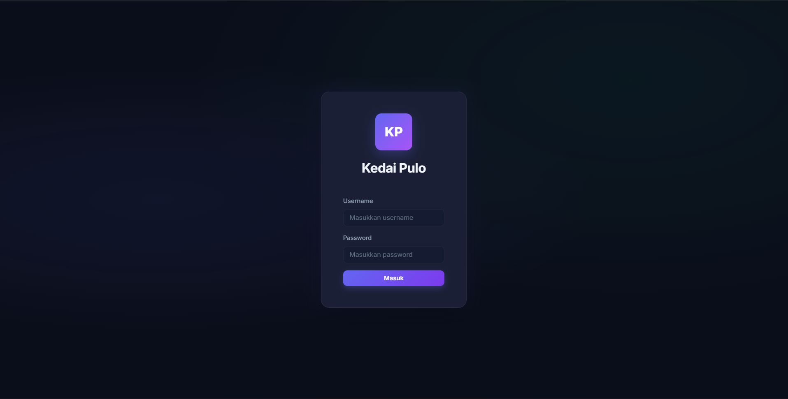
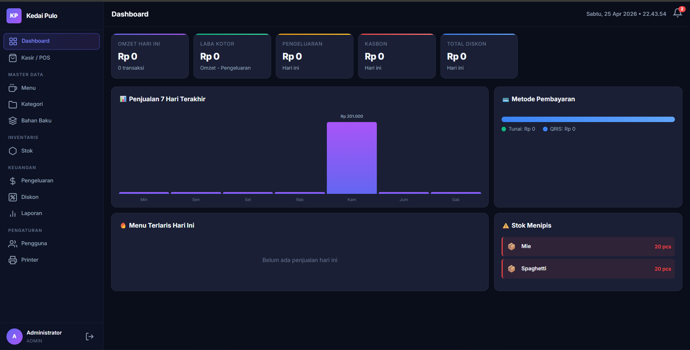
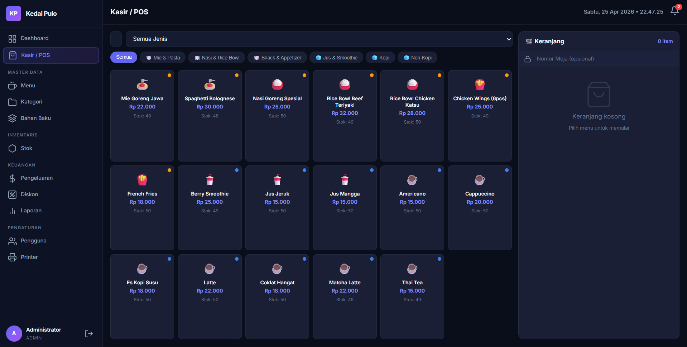
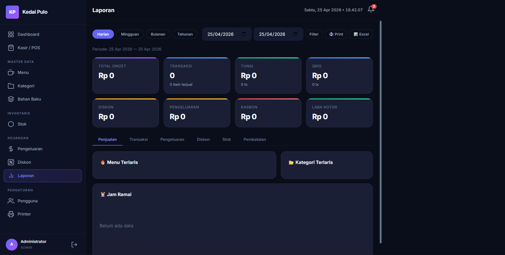

# Kedai Pulo POS

<div align="center">

**Sistem kasir modern berbasis Node.js untuk usaha F&B**  
Cocok untuk kedai, cafe, warung makan, dan bisnis kuliner skala kecil sampai menengah.


</div>

---

## Tentang Project

**Kedai Pulo POS** adalah aplikasi **Point of Sale (POS)** berbasis web yang dibuat untuk membantu operasional bisnis F&B dalam satu sistem terintegrasi.

Aplikasi ini mencakup proses penting seperti:
- autentikasi pengguna
- transaksi kasir
- pengelolaan menu
- monitoring stok
- pengeluaran operasional
- laporan penjualan
- manajemen user
- pengaturan printer
- upload QRIS

Project ini cocok dijadikan sebagai:
- bahan belajar fullstack web development
- project tugas akhir / PKL / portofolio
- dasar pengembangan aplikasi kasir yang lebih kompleks

---

## Fitur Utama

### Autentikasi & Role
- Login menggunakan session
- Role pengguna:
  - **Admin**
  - **Kasir**
  - **Owner**
- Hak akses halaman dan fitur berdasarkan role

### Dashboard
- Ringkasan transaksi harian
- Total pemasukan hari ini
- Total pengeluaran dan kasbon
- Ringkasan pembayaran tunai dan QRIS
- Top menu terlaris
- Notifikasi stok menipis
- Grafik penjualan 7 hari terakhir

### Kasir / POS
- Membuat transaksi baru
- Menambahkan item ke keranjang
- Hitung subtotal, diskon, dan total otomatis
- Metode pembayaran:
  - **Tunai**
  - **QRIS**
- Nomor invoice otomatis
- Nomor order harian otomatis
- Complete / cancel transaksi

### Manajemen Kategori & Menu
- Tambah kategori makanan dan minuman
- Tambah, edit, hapus menu
- Upload foto menu
- Atur harga menu
- Status menu aktif / nonaktif

### Bahan Baku & Stok
- Data bahan baku
- Monitoring stok bahan
- Monitoring stok menu
- Minimum stok
- Riwayat pergerakan stok
- Penyesuaian stok manual

### Diskon
- Diskon nominal
- Diskon persentase
- Diskon per transaksi / item
- Riwayat pengguna yang memberikan diskon

### Pengeluaran
- Catat pengeluaran operasional
- Kategori pengeluaran
- Status pengeluaran / kasbon
- Metode pembayaran
- Upload lampiran bukti pengeluaran
- Nomor pengeluaran otomatis

### Laporan
- Rekap transaksi berdasarkan periode
- Ringkasan pendapatan
- Total diskon
- Breakdown pembayaran tunai dan QRIS
- Ringkasan pengeluaran
- Menu terlaris
- Kategori terlaris
- Peak hour penjualan

### User Management
- Tambah user
- Edit user
- Nonaktifkan user
- Pengaturan role user

### Printer
- Manajemen printer **bar** dan **dapur**
- Printer default per jenis
- Status online / offline
- Test print
- Print log
- Retry print log
- Dukungan pengaturan koneksi printer

### Pengaturan Sistem
- Pengaturan berbasis key-value
- Upload gambar QRIS
- Hapus gambar QRIS
- Branding dan konfigurasi sistem

---

## Teknologi yang Digunakan

### Backend
- **Node.js**
- **Express.js**
- **Express Session**

### Database
- **SQL.js**

### Utility & Library
- **bcryptjs**
- **multer**
- **uuid**

### Frontend
- **HTML**
- **CSS**
- **JavaScript**

---

## Struktur Project

```bash
kasir/
├── database/
│   ├── init.js
│   └── kasir.db
├── middleware/
│   └── auth.js
├── public/
│   ├── css/
│   ├── js/
│   ├── uploads/
│   └── index.html
├── routes/
│   ├── auth.js
│   └── api/
│       ├── categories.js
│       ├── dashboard.js
│       ├── discounts.js
│       ├── expenses.js
│       ├── ingredients.js
│       ├── menus.js
│       ├── printers.js
│       ├── reports.js
│       ├── settings.js
│       ├── stocks.js
│       ├── transactions.js
│       └── users.js
├── server.js
├── package.json
└── package-lock.json
```

---

## Cara Menjalankan Project

### 1. Clone repository
```bash
git clone https://github.com/dewamerdeka17/kasir.git
cd kasir
```

### 2. Install dependency
```bash
npm install
```

### 3. Jalankan aplikasi
```bash
npm start
```

### 4. Buka di browser
```bash
http://localhost:3000
```

---

## Akun Default

Gunakan akun berikut untuk login pertama kali:

### Admin
- **Username:** `admin`
- **Password:** `admin123`

### Kasir
- **Username:** `kasir1`
- **Password:** `kasir123`

### Owner
- **Username:** `owner`
- **Password:** `owner123`

---

## Database

Project ini menggunakan file database lokal:

```bash
database/kasir.db
```

Saat aplikasi dijalankan, sistem akan otomatis:
- menginisialisasi database
- membuat tabel jika belum ada
- menyiapkan akun default
- menyimpan perubahan database secara berkala

Tabel utama yang digunakan antara lain:
- `users`
- `categories`
- `menus`
- `ingredients`
- `ingredient_stocks`
- `menu_stocks`
- `menu_recipes`
- `transactions`
- `transaction_items`
- `payments`
- `discounts`
- `expenses`
- `printers`
- `print_logs`
- `stock_movements`
- `settings`

---

## Endpoint / Modul Utama

Beberapa modul utama yang tersedia dalam project ini:

- `/auth`
- `/api/dashboard`
- `/api/categories`
- `/api/menus`
- `/api/ingredients`
- `/api/transactions`
- `/api/expenses`
- `/api/discounts`
- `/api/stocks`
- `/api/reports`
- `/api/users`
- `/api/printers`
- `/api/settings`

---

## Screenshot

### Login


### Dashboard


### POS / Kasir


### Laporan

---

## Keunggulan Project

- Tampilan modern dan mudah digunakan
- Struktur backend cukup rapi dan modular
- Sudah mendukung multi-role user
- Mendukung pembayaran tunai dan QRIS
- Memiliki fitur stok, laporan, diskon, pengeluaran, dan printer
- Cocok untuk portfolio project sistem kasir berbasis web
- Mudah dikembangkan menjadi aplikasi production-ready

---

## Pengembangan Selanjutnya

Beberapa ide pengembangan lanjutan:
- export laporan ke **PDF / Excel**
- integrasi printer thermal nyata
- tampilan yang lebih optimal untuk **tablet / mobile**
- kitchen display system
- notifikasi stok real-time
- integrasi pembayaran digital yang lebih luas
- audit log aktivitas user
- backup dan restore database
- dukungan multi cabang

---

## Catatan

Folder `node_modules/` sebaiknya **tidak di-push ke GitHub**.  
Tambahkan file `.gitignore` seperti berikut:
---

---

## Author

**Dewa Merdeka**  
Project portfolio sistem kasir berbasis web untuk kebutuhan pembelajaran, pengembangan, dan presentasi project POS F&B.

---

## License

Project ini dibuat untuk kebutuhan **portofolio dan pembelajaran**.
